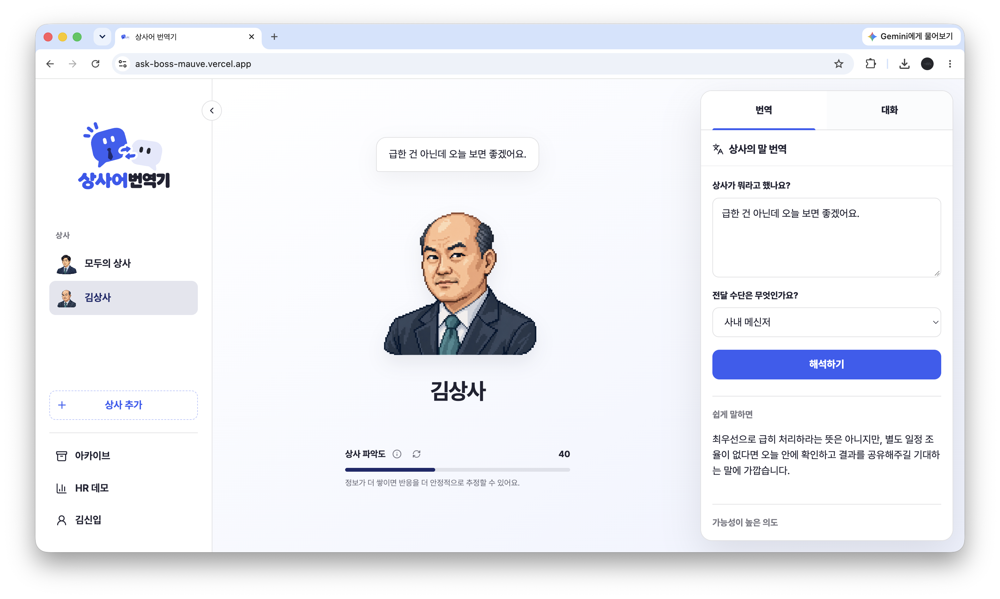

# 상사어 번역기

상사의 말에 담긴 속뜻을 몰라 답장에 끙끙대는 직장인이, 내 상사에 맞춘 해석과 대화 연습으로 소통 부담을 줄이도록 돕습니다.


## 실제 서비스 화면



## 주요 기능

- **상사 대화 시뮬레이션** — 분석된 페르소나로 가상 대화, 응답을 실제 상사 반응으로 교체 가능
- **번역/답변 추천** — 상사와의 대화 번역 및 상황별 답변 추천, 대화 탭으로 이동
- **대화 코칭** — 사용자 문장에 대한 수정 제안(코칭 카드) 제공
- **HR 인사이트 데모** — 조직 커뮤니케이션 통계 대시보드(실제 익명 집계/가상 데모 전환, 워드클우드, 차트)
- **아카이브** — 지난 대화·번역 기록 보관 및 재개
- **관리자 콘솔** — `/admin`에서 프롬프트/예시/이미지 관리 (공개 메뉴 미표시)

## 기술 스택

- **Web**: React 19, Vite, TypeScript, react-router, TanStack Query, zustand, framer-motion, recharts, @visx/wordcloud
- **API**: Node(Express 계열), Supabase(PostgreSQL), Mindlogic AI 연동, SSE 스트리밍
- **공유**: `packages/shared`에 Zod 스키마·타입 공유
- **배포**: Vercel — Web 정적 빌드 + `/api` Node Function 동일 origin

## 프로젝트 구조

```
apps/web        # React 웹 (features/ chat·translator·hr·onboarding·tutorial 등)
apps/api        # API 서버 (routes/ services/ prompts/ repositories/)
packages/shared # 공유 타입·스키마
supabase/       # 마이그레이션 SQL
e2e/            # Playwright E2E
scripts/        # 시드 스크립트 (seed:hr)
```

## 로컬 실행

```bash
pnpm install
cp .env.example .env.development
pnpm dev
```

개발 서버는 저장소 루트의 `.env.development`를 자동으로 읽으며, 셸에서 미리 export한 값이 항상 우선합니다. 모든 실제 `.env*` 파일은 Git에서 제외되고 `.env.example`만 추적합니다.

기본 로컬 모드는 외부 자격 증명 없이 메모리 저장소와 데모 AI로 동작합니다. 실제 연동 시 `DATABASE_URL`에는 Supabase Dashboard의 **Transaction Pooler URI**를 사용하고, Supabase와 Mindlogic 환경변수를 채웁니다. 직접 DB 호스트의 `5432` 주소는 로컬·Vercel 기본 연결로 사용하지 않습니다.

관리자 콘솔은 `/admin`에서 직접 접근합니다. 개발용 비밀값은 다음처럼 만들 수 있습니다.

```bash
openssl rand -base64 24 # ADMIN_PASSWORD 후보
openssl rand -hex 32    # ADMIN_SESSION_SECRET
```

생성한 값을 `.env.development`의 `ADMIN_PASSWORD`, `ADMIN_SESSION_SECRET`에 각각 넣습니다. 운영 환경에서는 두 값이 없으면 API가 시작되지 않습니다.

## 데이터베이스

`supabase/migrations`의 모든 SQL 파일을 번호 순서대로 적용하고 `boss-evidence` Bucket이 private인지 확인합니다. 신규 배포뿐 아니라 기존 환경도 저장소의 마지막 마이그레이션까지 적용해야 합니다. HR 데모 데이터는 `pnpm seed:hr`로 생성합니다.

## 배포

루트 Vercel 프로젝트 하나에서 Web 정적 빌드와 `/api` Node Function을 동일 origin으로 제공합니다. `/admin` 하위 경로도 SPA로 rewrite됩니다. 배포 전에 `.env.example`의 서버 환경변수를 Vercel에 등록하고 `/api/health/ai`에서 필수 모델을 확인합니다. 운영 관리자 로그인을 위해 `ADMIN_PASSWORD`, `ADMIN_SESSION_SECRET`을 반드시 설정하고, `WEB_ORIGIN`은 실제 운영 origin으로 설정합니다. 같은 배포 도메인의 `/admin` 요청은 Host와 Origin이 일치할 때도 허용됩니다.

## UI/UX 작업 규칙

UI/UX는 전담 담당자가 관리합니다. `apps/web`의 스타일·레이아웃·모바일 동작을 수정할 때는 루트 `AGENTS.md`의 규칙을 반드시 따릅니다.

## 검증

```bash
pnpm typecheck
pnpm test
pnpm build
pnpm test:e2e
```
